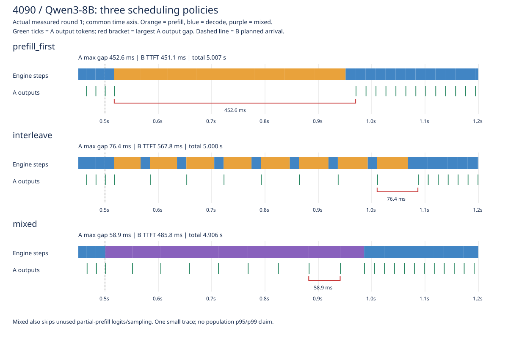
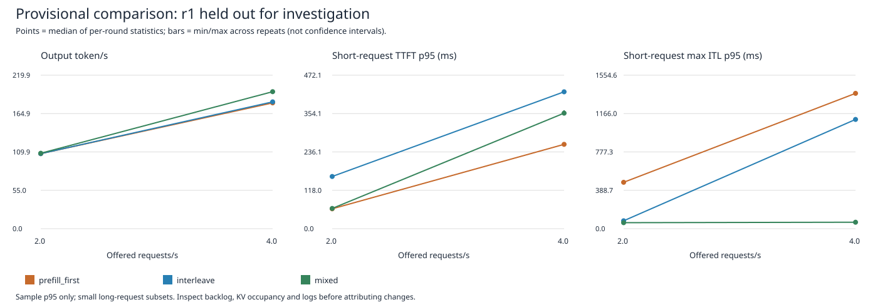
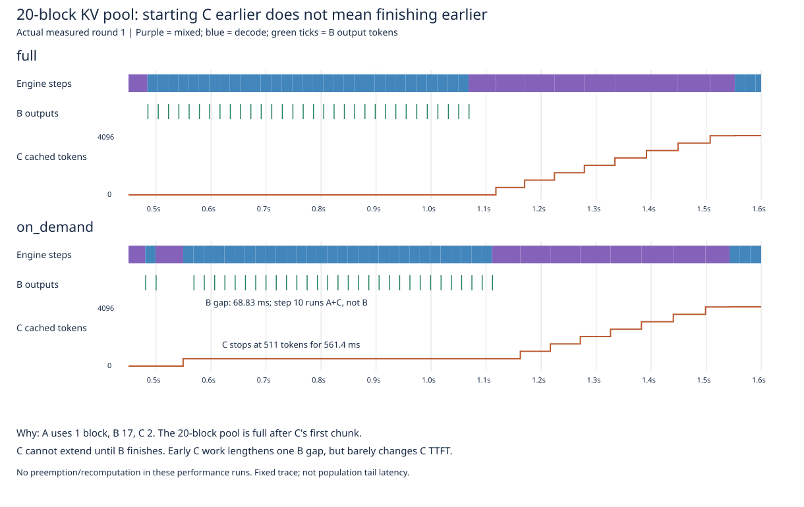

# nano-vllm-lab 项目报告：调度、KV资源与延迟的取舍

更新：2026-09-28。**一个基于nano-vllm的单卡机制实验，不是从零实现生产引擎，也不是与生产vLLM的性能竞赛。**

## 一句话结论

混合调度能减少长prompt造成的输出长停顿，但可能增加首token等待或中等长度的输出间隔；
按需KV能减少提前预留，却不保证接纳更多请求后就更快。项目的重点是实现、验证并解释这些取舍。

## 1. 原有能力和本项目增量

上游基线为`bb823b3`。分页KV、前缀共享、chunked prefill、TP、decode CUDA Graph和部分算子compile原本就有，不计作新增贡献。

| 本项目增量 | 实现内容 | 源码入口 |
|---|---|---|
| 可观察性与实验 | 固定输入、计划到达回放、真实输出token时间戳、step/KV计数、版本记录 | [bench_timeline.py](../bench_timeline.py) |
| 阶段交错 | 在完整prefill轮之间插入decode轮，作为中间对照 | [scheduler.py](../nanovllm/engine/scheduler.py) |
| 混合batch | decode与prefill chunk进入一次模型主体forward，处理逐请求query/KV边界和输出对齐 | [model_runner.py](../nanovllm/engine/model_runner.py) |
| 按需KV | 按本轮计算范围领块，维护前缀共享、准入和无进展时的抢占恢复 | [block_manager.py](../nanovllm/engine/block_manager.py)、[scheduler.py](../nanovllm/engine/scheduler.py) |

```text
原调度：    B prefill → B prefill → B prefill → A decode
阶段交错：  B prefill → A decode  → B prefill → A decode
混合batch：[B一段prefill + A decode] → [B下一段 + A decode]
```

mixed保留纯decode专用attention与CUDA Graph；含prefill的混合路径首版走eager，既有小算子compile仍在。
partial prefill只推进KV，不产生真实输出；mixed跳过其无效LM head/采样，并保持结果与请求对齐。
因此mixed是一组路径改动，**不是只改变调度顺序的单因素实验**。

按需KV领取的是预分配GPU池中的物理块，不是每轮重新申请GPU大tensor；`nvidia-smi`不一定下降。
目前mixed和on_demand限单GPU，on_demand必须搭配mixed，不能据此声称完成TP扩展验证。

## 2. 如何比较

- 硬件/模型：单张RTX4090、dense Qwen3-8B、BF16。同一实验内部固定环境、输入、到达trace、KV资源和输出工作量；不同会话不拼接样本。
- 软件记录：Python3.12.3，torch `2.7.0a0+7c8ec84dab.nv25.03` / CUDA12.8，Triton3.2.0，FlashAttention2.7.3，Transformers5.17.0。是已用环境，不是任意镜像的兼容性保证。
- 每配置2轮预热、3轮测量，冷前缀缓存元数据、模型/KV tensor保留；固定随机输入及输出长度，temperature=0.6、ignore_eos=True。
- TTFT从**计划到达**算起；token在`step()`返回时被观察。吞吐含到达间隙、CPU观测和收尾，不是纯GPU时间或HTTP服务性能。
- 公布的是逐轮统计量的三轮中位数，不把重复同一trace视作独立请求。无生产p99或稳态容量保证。

公开数值及来源：[逐轮CSV和版本/归档校验信息](evidence/provenance.json)。原始压缩包和完整时间线另行归档，**没有随Git仓库公开**；
这里的CSV是可检查的摘录，不替代全部原始证据，校验和也不等于可下载的数据。

## 3. 实验A：一次长请求进入，输出是否卡住

代码`534362f`，A在0秒到达（128入/256出），B在0.5秒到达（4096入/64出）。
请求上限2、计算预算512、同一自动KV池121块；三种调度均使用原KV分配。

| 三轮中位数 | 原调度 | 阶段交错 | 混合batch |
|---|---:|---:|---:|
| A每轮最大ITL | 452.83ms | 76.41ms | 58.92ms |
| B计划TTFT | 451.07ms | 569.37ms | 485.83ms |
| 整轮输出token/s | 63.95 | 63.99 | 65.23 |

来源：[9个测量轮](evidence/mixed_rounds.csv)。这不是A的p95；先取每轮最大间隔，再跨轮取中位数。

原始时间线中，B在原策略连续占用8个512-token prefill轮，A停住；mixed前8轮各执行B511+A1，最后一轮B8+A1，A每轮都有输出。
**收益是处理B时继续推进A，不是把B的计算免费消掉**：A最长停顿减少86.99%，B首token反而慢7.71%，整轮吞吐仅提高2.00%。



## 4. 实验B：连续到达时，效果和代价还在吗

代码`5e1e6fd`。每轮32请求，混合负载为24短（128入/64出）+8长（4096入/32出），等间隔到达；
固定原KV分配64块、请求上限8、计算预算512。每轮只有8条长请求，长请求分位数尤其需要谨慎。

| 负载 / 指标 | 原调度 | mixed | 解读 |
|---|---:|---:|---|
| 2请求/秒：短请求最大ITL的p95 | 469.79ms | 60.78ms | 长停顿减少 |
| 2请求/秒：短请求token间隔p95 | 19.00ms | 56.26ms | **中等间隔增多** |
| 2请求/秒：长请求TTFT p95 | 465.42ms | 516.37ms | +10.95% |
| 4请求/秒：输出token/s | 180.21 | 196.26 | +8.91% |
| 4请求/秒：短请求最大ITL的p95 | 1370.72ms | 65.33ms | -95.23% |
| 4请求/秒：短请求TTFT p95 | 259.42ms | 355.34ms | **+36.98%** |
| 4请求/秒：长请求TTFT p95 | 466.10ms | 547.65ms | +17.49% |
| 全短4请求/秒：输出token/s | 228.75 | 228.67 | 基本相同 |

来源：[36轮摘录，含未采用的r1](evidence/arrival_rounds.csv)。执行顺序在负载之间轮换，不是严格随机交错A/B。

**为什么两种ITL结论不同？** “最大ITL的p95”先为每条请求取最坏间隔，再对请求取分位数；“token间隔p95”把所有间隔放在一起。
r2每轮1512个短请求间隔：原调度61个超过40ms，其中16个超过200ms；mixed189个超过40ms，0个超过200ms，三轮一致。
这说明长停顿变成了较多中等间隔，不能只挑好看的指标写成“ITL p95全面下降”。



图中只有两个到达率，不拟合饱和点或推广到任意负载。两种负载及全短对照27个测量轮没有抢占/重算。

### r1为什么暂不用于收益结论

1请求/秒的原调度和交错约75秒才完成，mixed约32秒；但前两组每轮有95～97个>200ms的step。
六个测量轮中四轮，在**只有首条请求、尚无KV压力**时，首prefill就约743～746ms，后续同输入对照约46～49ms。
decode也夹杂约700ms停顿；交错第一轮没有抢占仍慢到75.41秒。因此抢占不能解释最早的异常。

启动配置检查通过，日志未发现编译警告，但没有运行期CPU/GPU监控或profiler，**底层原因未知，不能确认是环境还是某执行路径问题**。
整个r1比较（包括mixed）标记待诊断、保留原值，不把它包装成2.3倍加速。数据自洽不意味着性能可比。

## 5. 实验C：按需KV的负结果

代码`59f46ab`，固定mixed，只比较full/on_demand；A128入/64出、B/C4096入/32出，A/B在0秒、C在0.02秒到达。
请求上限2、预算512，在人为64/20块池内成对比较，不是4090容量极限测试。

| 三轮中位数或各轮相同峰值 | full | on_demand |
|---|---:|---:|
| 64块池输出token/s | 61.4741 | 61.5900 |
| 20块池输出token/s | 60.5236 | 60.5987 |
| 两种池的未写入整块峰值 | 17 | 3 |
| 64块池已分配块峰值 | 35 | 35 |
| 20块池B每轮最大ITL中位数 | 18.884ms | 67.927ms |

来源：[12个测量轮](evidence/kv_rounds.csv)。未写入块是在forward前计数，包含本轮即将写入的块；**17→3不是总显存减少82%**。
吞吐差异仅约0.1%～0.2%，不宣称稳定加速。全部性能轮无抢占/重算，不能把退化归于重计算。

原时间线结合同版本调度器状态重建发现：20块池下，C提前算511 token，占用2块；A/B/C共持有1/17/2块，池满。
这一轮只安排A+C，B因两个请求槽位上限被挤出。随后C停住约561ms，等B完成释放块才继续，B最长间隔却已变大。
引用计数和逐请求选择由匹配日志的CPU状态重建检查，不冒称云端记录了每块引用计数。

**反思：能分配第一段空间，不代表现在接纳就有利于延迟。** 分配、准入、请求槽位和进展保障必须一起考虑；
这一个负结果既不证明按需分配无用，也不证明更保守准入总是更好。



## 6. 正确性与未完成的边界

- `5e1e6fd`本地94项CPU测试通过，覆盖预算、块边界、共享引用、输出对齐、抢占恢复及指标计算，不当作性能实测。
- mixed云端诊断324项、on_demand诊断648项attention比较通过：同Q/K/V的独立FP32因果attention参考，rtol/atol均0.025。
  另检查单次主体forward、KV写入、前缀复用及partial零输出；3块诊断池发生1次抢占、255 token实际重算。
- 这些是所覆盖场景的检查，**不是完整模型独立logits参考或全部新batch形状验证**。诊断的重编译警告另行保留，不计入性能结果。
- 只完成“原KV下三种调度”和“mixed下两种KV分配”的对照，未完成所有组合的全因子消融。
- 尚缺代表性真实语料、更多独立trace、运行期硬件监控、稳态SLO goodput和与生产引擎的公平对照；不为这些缺项预填结果。

## 7. 复现入口与收尾范围

从本仓库对应历史提交创建独立工作目录，不覆盖正在开发的分支；使用已验收环境和相同模型快照。

| 实验 | 对应提交 | 在对应版本仓库根目录执行 |
|---|---|---|
| 两请求调度 | `534362f` | `python -u run_mixed_experiment.py --model "$MODEL"` |
| 按需KV | `59f46ab` | `python -u run_kv_experiment.py --model "$MODEL"` |
| 持续到达 | `5e1e6fd` | `python -u run_arrival_experiment.py --model "$MODEL"` |

先设置`MODEL`为本机Qwen3-8B完整模型目录。旧两请求实验自动池实测121块，环境变化若导致池不同，应另标新实验，不能与旧数据无条件合并。
原始模型revision未完整固定，仅保存元数据哈希/权重文件大小，因此重下载模型不能保证精确重现。
持续到达完整流程和时间预算见[运行说明](ARRIVAL_EXPERIMENT.md)；这些是复现入口，**不是现在必须再跑一遍的待办**。

首版到这里收尾：机制实现、正确性保护、受控对照、负结果解释及异常标记。后续优先补诊断/证据，不继续堆量化、多卡或投机解码。
面试讲述见[讲述提纲](INTERVIEW_GUIDE.md)。
